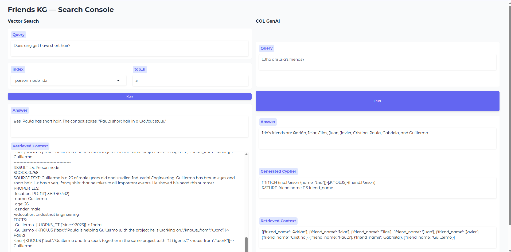

# playKG: Neo4j Hello World

A hands-on playground for exploring Knowledge Graphs and implementing Retrieval-Augmented Generation (RAG) with Neo4j.

## Overview

This project provides a comprehensive introduction to knowledge graphs, demonstrating how to set up Neo4j with Docker and interact with graph databases using Python. The implementation showcases both traditional graph queries and modern semantic search capabilities within a RAG pipeline architecture.

The core focus is on building a **Knowledge Graph RAG (KG-RAG) pipeline** that enables natural language queries against a knowledge graph containing structured information about people, companies, and their relationships.

## Architecture

The system implements two complementary retrieval methods that form the foundation of an intelligent query system:

## Retrieval Methods

### 1. Vector Search (Semantic Retrieval)
Leverages embedded node and relationship properties to perform similarity-based searches. The system:
- Embeds user queries into vector space
- Performs similarity matching against pre-computed embeddings of graph properties
- Returns semantically relevant context to the LLM
- **Current limitation**: Requires manual configuration of which properties to search

### 2. CQL Search (Structured Retrieval)
Uses Large Language Models to automatically generate Cypher Query Language (CQL) statements:
- Translates natural language queries into precise graph traversals
- Executes structured queries against the knowledge graph
- Provides deterministic, relationship-aware results
- **Current limitation**: Does not yet integrate with vector search capabilities

### 3. Fusion Layer (Future Enhancement)
The planned evolution will combine both retrieval methods autonomously:
- Intelligent routing between vector and structured search
- Hybrid result combination and ranking
- Full integration for autonomous agent deployment

## Getting Started

This playground includes practical examples of:
- Setting up Neo4j with Docker Compose
- Creating and managing graph nodes and relationships
- Implementing vector embeddings for graph properties
- Building natural language query interfaces
- Integrating with LLMs for automated query generation

Perfect for developers, data scientists, and AI engineers looking to understand the intersection of knowledge graphs and modern RAG architectures.

## Usage

### 1. Start Neo4j Images

```bash
docker compose up -d
```

This will initiate the **Neo4j** container which provides:

- **Neo4j graph database** server with APOC plugins enabled for advanced procedures and functions
- **Neo4j Desktop** to access the browser interface for database management and query execution

Additionally initiate **Neo4j Dash** which provides a web-based dashboard application for creating interactive visualizations and reports from your Neo4j data.

### 2. Install Python deps

```bash
python -m venv .venv
source .venv/bin/activate  
pip install uv
uv sync
```

### 3. Run Ollama

```bash
ollama serve
ollama pull nomic-embed-text
```

### 4.Set up Vertex AI API

```bash
sudo snap install google-cloud-cli
gcloud auth application-default login
gcloud config set project my-cool-project
gcloud auth application-default set-quota-project my-cool-project
```

This will open a login chrome tab (if it doesn't, just click the link that will appear in the logs).

Activate the Vertex API for the project at: https://console.cloud.google.com/


### 5. Testing the setup

Run `load_friends.py`. 
Run `query_friends_graph.py`.


### 6. Try the Gradio Web App

   - Run:
     ```bash
     python app_gradio.py
     ```
   - This launches a simple UI for both vector search and Cypher (CQL) GenAI queries over your knowledge graph.

   


#### How it Works

- The project demonstrates semantic retrieval on a knowledge graph: you can ask natural language questions, which are translated to graph queries enhanced with vector search over text properties.
- The Gradio app (`app_gradio.py`) provides two panels:
  - **Vector Search:** Enter a question, select an index, and get semantic matches.
  - **CQL GenAI:** Enter a natural language question to generate and run Cypher graph queries with GenAI assistance.

# Learning Resources

- [Neo4j Cypher Cheat Sheet](https://neo4j.com/docs/cypher-cheat-sheet/5/all/)


