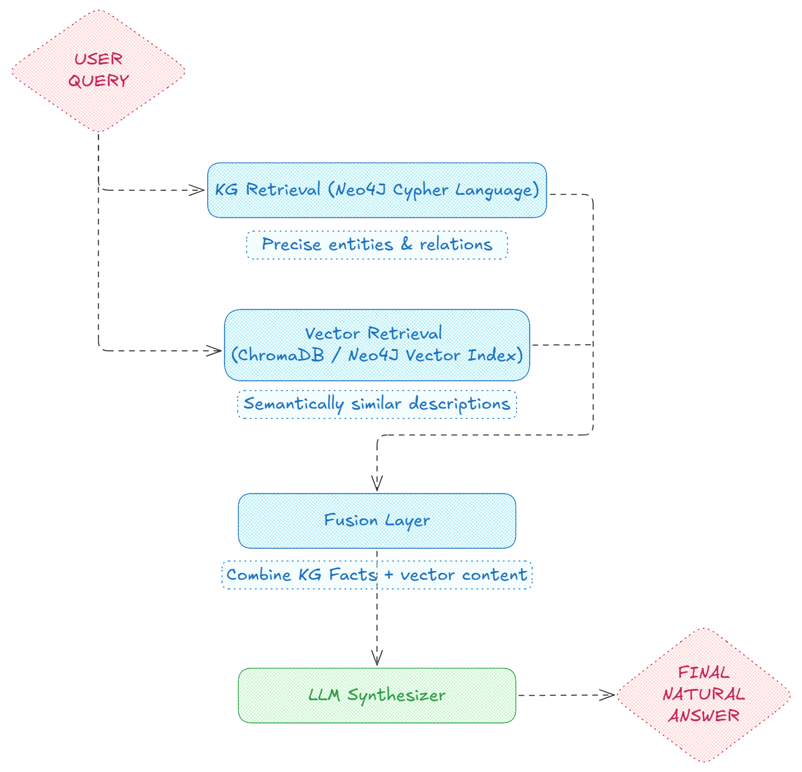

# playKG: Neo4j Hello World

Hi! This is a playground to understand Knowledge Graphs. This project demonstrates how to set up a simple Neo4j database using Docker, and interact with it using Python. It includes examples of creating nodes and relationships, as well as querying the graph.

# Setup

## 1. Start Neo4j:

```bash
docker compose up -d
```

## 2. Install Python deps

```bash
python -m venv .venv
source .venv/bin/activate  
pip install uv
uv sync
```

## 3. Testing the setup

Run Jupyter notebook `neo4j_playground.ipynb`. 

All Cypher queries are stored in `queries.yaml` file, and the notebook loads them automatically.
The use case demonstrates how to **create nodes** and **relationships**, **query** the graph, and **clean** up the database.

**Optional but recommended: Neo4j Desktop**

Interactively run Cypher queries. Open Neo4j browser at `http://localhost:${HTTP_PORT}` and login with the credentials in the `.env` file.


# Learning Resources

- [Neo4j Cypher Cheat Sheet](https://neo4j.com/docs/cypher-cheat-sheet/5/all/)


# KG RAG Notes

