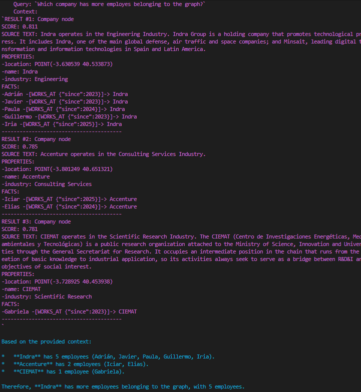

# playKG: Neo4j Hello World

Hi! This is a playground to understand Knowledge Graphs. This project demonstrates how to set up a simple Neo4j database using Docker, and interact with it using Python. It includes examples of creating nodes and relationships, as well as querying the graph.

The project implements the **semantic retrieval** component of a KG RAG pipeline, which enables natural language queries against a knowledge graph containing information about people and companies.


## Usage

### 1. Start Neo4j and NeoDash

```bash
docker compose up -d
```

### 2. Install Python deps

```bash
python -m venv .venv
source .venv/bin/activate  
pip install uv
uv sync
```

### 3. Run Ollama

```bash
ollama serve
ollama pull nomic-embed-text
```

# Set up Vertex AI API

```bash
sudo snap install google-cloud-cli
gcloud auth application-default login
gcloud config set project my-cool-project
gcloud auth application-default set-quota-project my-cool-project
```

This will open a login chrome tab (if it doesn't, just click the link that will appear in the logs).

Activate the Vertex API for the project at: https://console.cloud.google.com/


### 3. Testing the setup

Run `load_friends.py`. 
Run `query_friends_graph.py`.




**Optional but recommended: Neo4j Desktop**

Interactively run Cypher queries. Open Neo4j browser at `http://localhost:${HTTP_PORT}` and login with the credentials in the `.env` file.


The system demonstrates how vector embeddings can enhance traditional graph queries by enabling semantic search over unstructured text properties within a structured knowledge graph.

# Learning Resources

- [Neo4j Cypher Cheat Sheet](https://neo4j.com/docs/cypher-cheat-sheet/5/all/)


